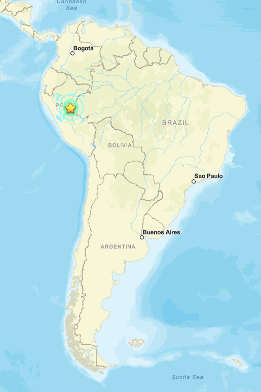

# 🌎 Detecção de Distúrbios Ionosféricos Associados ao Terremoto do Peru (2011)

<p align="center">
  
</p>

Este repositório reúne os códigos desenvolvidos para o processamento de dados GNSS e aplicação da **Análise por Componentes Principais (PCA)** na investigação de possíveis **Distúrbios Ionosféricos Co-sísmicos (CIDs)** associados ao terremoto ocorrido no **Peru em 2011**.

O processamento consiste na leitura dos dados de TEC obtidos por estações GNSS, remoção da tendência ionosférica, organização dos dados em matrizes espaço-temporais e aplicação da PCA para identificação dos principais modos de variabilidade da ionosfera.

---

# 🎯 Objetivo

Investigar possíveis perturbações ionosféricas relacionadas ao terremoto do Peru (2011), utilizando dados GNSS e técnicas estatísticas de redução de dimensionalidade.

---

# 🚀 Etapas do Processamento

O fluxo completo do processamento é dividido nas seguintes etapas:

```text
Arquivos GNSS (.Cmn / TEC)
            │
            ▼
Leitura dos dados
            │
            ▼
Filtragem por satélite (PRN)
e ângulo de elevação
            │
            ▼
Remoção da tendência do STEC
(Ajuste exponencial)
            │
            ▼
Filtragem temporal
(Média móvel)
            │
            ▼
Seleção do intervalo do evento
            │
            ▼
Construção da matriz
Estações × Tempo
            │
            ▼
Aplicação da PCA
            │
            ▼
EOFs + PCs
            │
            ▼
Interpolação espacial
            │
            ▼
Mapas ionosféricos
```

---

# 📊 Dados Utilizados

Os dados utilizados são provenientes de receptores GNSS distribuídos pela América do Sul.

Cada arquivo contém informações como:

- Tempo
- PRN (satélite)
- Azimute
- Elevação
- Latitude do ponto ionosférico
- Longitude do ponto ionosférico
- STEC
- VTEC
- Índice S4

---

# ⚙️ Processamento dos Dados

Durante o processamento são realizadas as seguintes etapas:

- Leitura dos arquivos `.Cmn`
- Seleção do satélite (PRN)
- Filtragem por ângulo de elevação (>30°)
- Ajuste exponencial para remoção da tendência do STEC
- Aplicação de médias móveis
- Extração do intervalo correspondente ao terremoto
- Construção da matriz utilizada pela PCA

---

# 🧮 Análise por Componentes Principais (PCA)

A PCA é utilizada para reduzir a dimensionalidade da matriz de dados e identificar os principais padrões de variabilidade presentes na ionosfera.

A partir da matriz:

```text
Estações × Tempo
```

são obtidos:

- Componentes Principais (PCs)
- Funções Ortogonais Empíricas (EOFs)
- Variância explicada por cada componente

Os EOFs representam os padrões espaciais dominantes, enquanto os PCs descrevem a evolução temporal desses padrões.

---

# 🗺️ Geração dos Mapas

Após a obtenção dos EOFs, é realizada a interpolação espacial dos valores utilizando uma malha regular de latitude e longitude.

As principais etapas são:

- Construção da malha (grid)
- Interpolação espacial
- Plotagem dos mapas
- Comparação entre diferentes componentes principais

---

# 📂 Estrutura do Projeto

```text
Peru_2011
│
├── Dados_GNSS
│   ├── Arquivos_CMN
│   ├── Arquivos_TEC
│   └── Estações
│
├── Processamento
│   ├── Leitura
│   ├── Filtragem
│   ├── Normalização
│   └── Construção_da_Matriz
│
├── PCA
│   ├── EOFs
│   ├── PCs
│   ├── Variância
│   └── Mapas
│
├── Figuras
│
└── README.md
```

---

# 🛠️ Linguagem Utilizada

Todo o processamento foi desenvolvido em:

- MATLAB

---

# 📈 Produtos Gerados

O processamento produz:

- Matrizes de TEC processadas
- Séries temporais dos PCs
- EOFs
- Mapas interpolados
- Figuras para análise dos distúrbios ionosféricos

---

# 📚 Metodologia

A metodologia aplicada segue as seguintes etapas:

1. Leitura dos dados GNSS;
2. Filtragem dos satélites e estações;
3. Remoção da tendência ionosférica;
4. Construção da matriz espaço-temporal;
5. Aplicação da PCA;
6. Interpretação dos EOFs e PCs;
7. Geração dos mapas espaciais.

---

# 👩‍💻 Autora

**Laura Trigo**

Projeto desenvolvido durante a pesquisa de Iniciação Científica na área de Geodésia Espacial e Monitoramento da Ionosfera.

---

# 📜 Licença

Este projeto possui fins exclusivamente acadêmicos e científicos.
